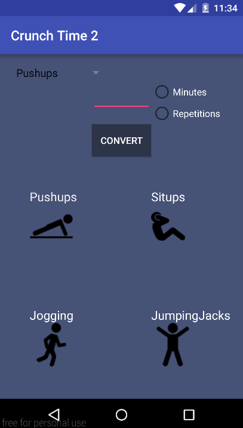

# PROG 01: Crunch Time

Briefly describe your app here.
This android application allows you to see how many 
calories you burn depending on which workout,
(situps, pushups, jumping jacks, jogging). You can input 
how  many minutes or reps you did of that certain workout
and you will get the calories burned as well as the the amount
of reps or minutes needed for other workouts to equal the same
amount of calories you just burned. To run you choose the workout,
then you input the number of reps or minutes you did and you choose
whether you did reps or minutes.  The you press on convert.

## Authors

Antonio Contreras ([tones24@berkeley.edu](mailto:tones24@berkeley.edu))

## Demo Video

See [CS160 Proj1: Crunchtime] (https://vimeo.com/154269341)

## Screenshots

## Acknowledgments

* Hat tip to anyone who's code was used
* Any other support

*Feel free to enhance your README. For Markdown syntax, see [the GitHub Guides](https://guides.github.com/features/mastering-markdown/). Remove this line in your submission.*
